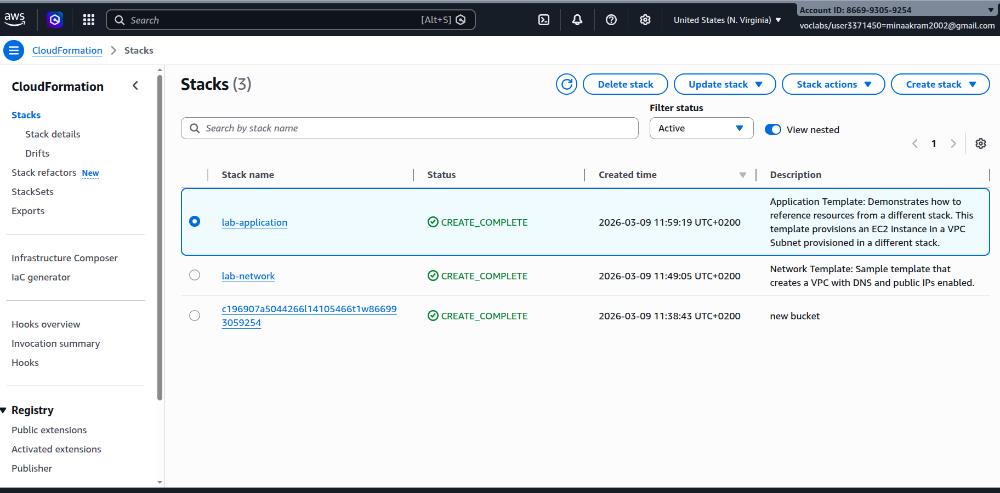
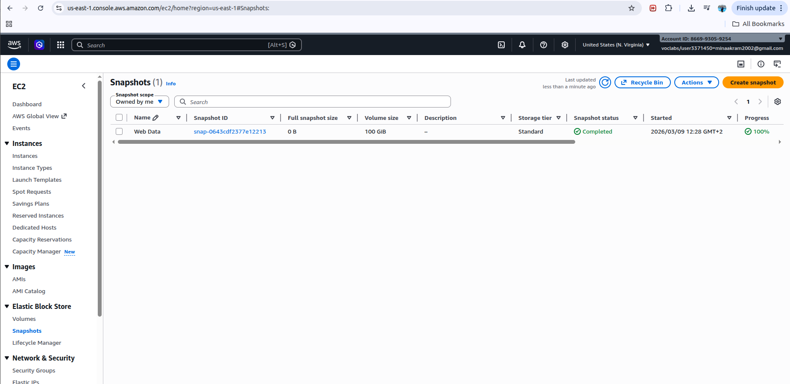

# Infrastructure as Code: Modular AWS Deployment via CloudFormation

## Overview
This project demonstrates an enterprise-grade approach to **Infrastructure as Code (IaC)** by deploying a decoupled, multi-tier architecture using AWS CloudFormation. The focus is on modularity, cross-stack resource sharing, and implementing lifecycle data protection policies.

## Modular Infrastructure Design
The architecture is decoupled into independent layers to enhance reusability and simplify maintenance:

* **Networking Layer:** ([lab-network.yaml](./templates/lab-network.yaml)) - Provisions a custom VPC, Public Subnets, Route Tables, and an Internet Gateway (IGW).
* **Application Layer:** ([lab-application.yaml](./templates/lab-application.yaml)) - Deploys an Apache Web Server on EC2. This stack dynamically consumes outputs from the Networking stack using `Fn::ImportValue`.

## Technical Implementations

### Cross-Stack Referencing
Leveraged CloudFormation **Outputs** and **Exports** to link stacks. This ensures that the application layer is always synced with the underlying network topology without hardcoding IDs.

### Change Set Management & Security Updates
Implemented security enhancements (Enabling HTTPS/Port 443) using **CloudFormation Change Sets**. This allowed for a dry-run analysis of impact before execution, ensuring zero-downtime and preventing accidental resource replacement.

### Infrastructure Visualization
Utilized **AWS Infrastructure Composer** to validate the logical relationship between resources and ensure architectural alignment.

### Data Persistence Policy
To ensure business continuity, a `DeletionPolicy: Snapshot` was applied to the EBS volumes. This guarantees that a point-in-time recovery point is created automatically if the stack is decommissioned.

## Implementation Gallery

### 1. CloudFormation Stack Lifecycle

*Execution status: All stacks verified in CREATE_COMPLETE state.*

### 2. Architectural Visualization

*Resource dependency mapping via AWS Infrastructure Composer.*

### 3. Security Group Ingress Update

*Verification of inbound rule updates for HTTPS (TCP/443) via Change Set.*

### 4. Automated Backup (EBS Snapshot)

*Validation of snapshot generation triggered by the DeletionPolicy.*

## Technical Stack
* **Provider:** Amazon Web Services (VPC, EC2, CloudFormation)
* **Language:** YAML (IaC)
* **Architectural Tooling:** AWS Infrastructure Composer
